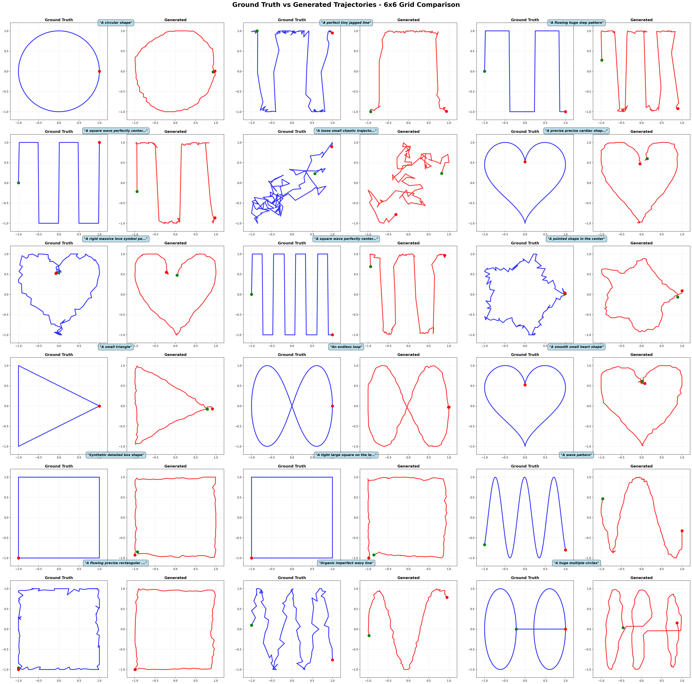
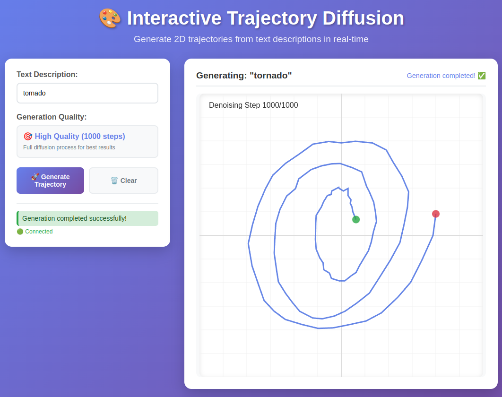

# 2D Geometric Shape Trajectory Diffusion

Generate 2D trajectories using text-conditioned diffusion models with mathematical patterns like sine waves, spirals, circles, and cardioids.

Trajectory generation is valuable for robotics path planning, autonomous navigation, animation, and motion synthesis. This repository serves as a toy example for learning text-conditioned diffusion on simple 2D geometric shapes.

This repo uses [SentenceTransformer](https://sbert.net/) for text embedding, [UNet1D](https://huggingface.co/docs/diffusers/en/api/models/unet) for trajectory generation, and [Denoising Diffusion Probabilistic Models (DDPM)](https://arxiv.org/abs/2006.11239)




## Quick Start

```bash
# Install dependencies
pip install -r requirements.txt

# Generate dataset
python generate_dataset.py

# Train model
python trainer.py

# Generate new trajectories  
python inference.py --exp_idx 0 --num_samples 20 --create_plots
```

## Denoising Process Visualized

<div align="center">
  
  
  
</div>


## Features & Architecture

- **Text-conditioned generation**: Generate trajectories from text descriptions, embed through SentenceTransformer
- **Mathematical patterns**: Sine waves, spirals, circles, lemniscates, cardioids
- **UNet1D architecture**: 1D U-Net with cross-attention for text conditioning
- **DDPM diffusion**: Denoising diffusion probabilistic models
- **Model components**:
  - Sinusoidal time embeddings
  - Cross-attention for text conditioning
  - Residual blocks with skip connections
  - Self-attention at multiple scales

## Files

- `generate_dataset.py` - Create mathematical trajectory patterns
- `model.py` - UNet1D architecture with text conditioning
- `trainer.py` - Training script with experiment management
- `inference.py` - Generate new trajectories
- `flask_app/` - Web interface for interactive generation

## Interactive Generation


```bash
cd flask_app
python app.py
```

Open http://localhost:5000 for interactive trajectory generation.




